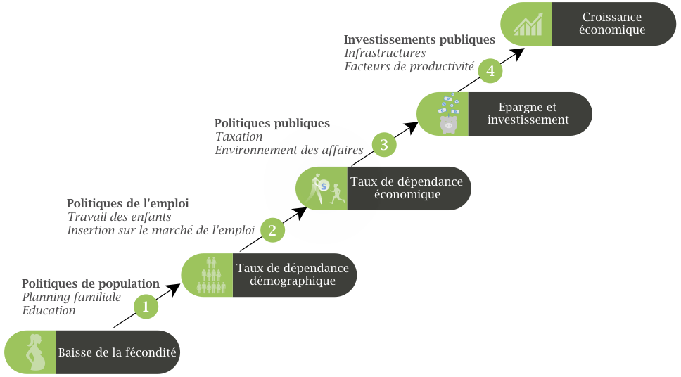
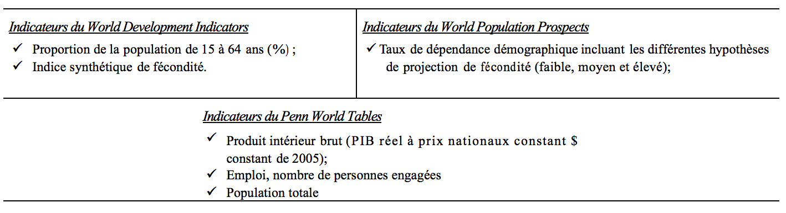
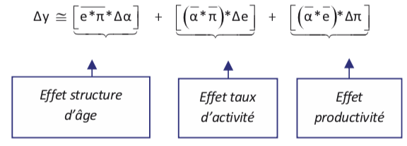
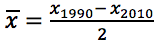
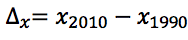

   

La baisse de la fécondité au niveau national a un effet sur la croissance du produit intérieur brut par habitant à travers le changement de la structure par âge de la population. (Mason, and Lee, 2005 ;  Bloom and Canning, 2008). Ce processus se met en place de façon graduelle et comprend (04) grandes étapes. D'abords, la baisse de la fécondité engendre une diminution de la population jeune (<15 ans) et induit de fait un changement dans la structure par âge. La seconde consiste en une augmentation de la population en âge de travailler et donc une de charge démographique. La troisième étape établit le lien entre la production totale et l'ensemble des personnes en âge de travailler. Enfin, la quatrième étape met en exergue la conversion de la productivité des personnes en âge de travailler et le PIB par habitant. Le fonctionnement effectif de cette chaîne dépend des politiques mises en œuvre par chaque pays. 

 
 
   
<em>Figure 1: Processus de production du dividende démographique et politiques à envisager</em>

  

##### <b>Sources des données de l'application</b>

 Les données utilisées pour les analyses sont issues de plusieurs sources. Elles proviennent de la base World Development Indicators (WDI) de la banque mondiale 2014, du World Population Prospects, révision 2017 de la Division de la Population des Nations Unies et de Penn World Tables (version 8.1).
  

  

##### <b>Méthodes d'analyse</b>

 <b>La projection des taux de dépendance</b> : Le taux de dépendance démographique se définit comme le nombre de personnes inactifs (moins de 15 ans et 65 ans et plus) pour cent personnes actives de 15-64 ans. Cet ouvrage pose l'hypothèse selon laquelle pour bénéficier d'une fenêtre d'opportunité démographique á une date t donnée, un pays doit avoir à cette date un taux de dépendance démographique inférieur à 30%, (par exemple 25% moins de 15ans et 20% de plus de 65ans). Pour cet exemple, 45% de population totale dépend de 55% de population totale en âge de travailler 100*(45/35) = 80%.  De 1975 à 2015 l'on utilise les données estimées du taux de dépendance totale figurant dans la source de données. De 2015 à 2035, l'on utilise les données projetées du taux de dépendance selon les trois hypothèses de fécondité suivantes : haute, médiane et basse. Le scénario avec une fécondité basse (haute) correspondant à moins (plus) 0,5 enfant par femme par rapport au taux du scénario médian. Le scénario médian correspond à la médiane des chemins possibles l'évolution futur de la population, simulé avec une approche bayésienne et à partir de la distribution à posteriori des paramètres de la population.
  

 <b>La décomposition</b> : est un "bouquet de méthodes" qui vise à découper un processus en composants élémentaires. En sciences sociales, elle peut servir à estimer la contribution relative de deux ou plusieurs facteurs complémentaires à un changement observé sur un indicateur socio-économique (Eloundou et al, 2018). Ainsi, dans un pays donné, le produit intérieur brut par habitant (y) est une fonction du produit intérieur brute (Y) et de la population totale (P), soit y =Y/P. Si l'on désigne par A la population en âge de travailler (15-64 ans) et par O l'ensemble de la population occupée, on peut écrire y=Y/P = (Y/O) * (O/A) * (A/P) = α*e*π où (α=A/P) est  un indicateur de la structure par âge de la population, (e=O/A) est taux d'activité et (π=Y/O) est la productivité des personnes occupées. Un changement de produit intérieur brut par habitant en 1990 et 2010 peut alors être décomposé trois éléments qui sont : contribution de la structure par âge, contribution du taux d'activité et contribution de la productivité.
  

  

Dans cette expression, on note que  et  . Le PIB est mesuré en $ constant de 2005.
    

 <b>Le processus</b> : L'analyse du processus par lequel la baisse de la fécondité pourrait aboutir à un changement de la richesse par habitant, se réalise en calculant les ratios entre les taux de croissance annuel moyen de chaque indicateur. Ces ratios sont appelés coefficient de conversion.
  

***

##### <b>Référence</b>

1. Bloom, D. E. and Canning, D. (2008). Global demographic change: Dimensions and economic significance. Population and Development Review 34(Supplement): 17-51
2. Eloundou-Enyegue P. M. (ed.),  Giroux S. C. (ed.),  Tenikue M. (ed.), 2018. Comprendre le changement social  : apport des méthodes de décomposition et application à l'étude du dividende démographique. Paris, Réseau pour le renforcement de la formation démographique en Afrique francophone (FraNet), UIESP. 47 pages.
3. Mason, A. & Lee, S.H. (2005). The demographic dividend and poverty reduction. In Proceedings of the United Nations Seminar on the Relevance of Population Aspects for the Achievement of the Millennium Development Goals, November 17-19, 2005, New York, NY.

##### <b>Ouvrages à télécharger</b>

* [Le dividende démographique en Afrique. Premiers signes et estimation par la méthode de décomposition](https://iussp.org/sites/default/files/DDE_2018.pdf)
* [Comprendre le changement Social. Apport des méthodes de décomposition et application à l'étude du Dividende Démographique.](https://iussp.org/sites/default/files/Decomposition_2018.pdf)
* [Understanding Social Change. A Decomposition Approach. (Version anglaise du volume ci-dessus)](https://iussp.org/sites/default/files/ChangementSocial_Anglais.pdf)

