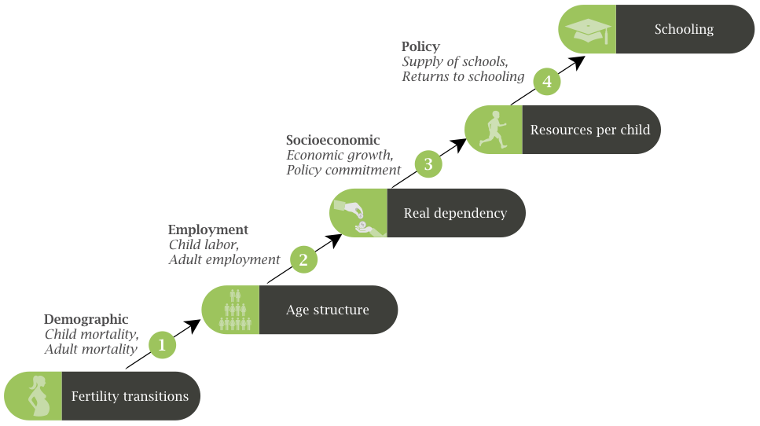
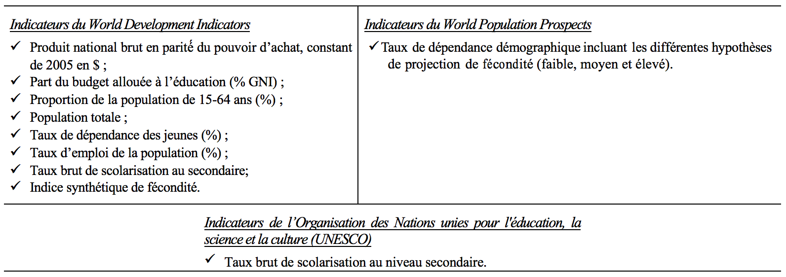
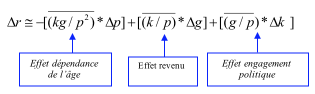
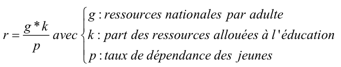

 

 Le « dividende démographique » est aujourd’hui comme un élément central du débat sur l’émergence africaine. Selon cet argument, les changements démographiques en cours pourraient appuyer les efforts de développement du continent en créant des conditions propices à l’épargne, l’investissement productif, et l’amélioration du capital humain. Ce nouveau discours empreint d’optimisme a désormais cours aussi bien dans les cercles académiques et politiques que ceux des médias et du grand public. Toutefois, de nombreuses questions subsistent quant à la matérialisation effective, l’ampleur, la distribution, et les conditions de ce dividende.
  

Les « lions africains » suivront-ils l’exemple des « tigres asiatiques » en capturant les bénéfices potentiels de leur transition démographique ? Ce dividende est-il une condition nécessaire/suffisante à l’émergence ? Quelle est son ampleur et quels sont les secteurs économiques et sociaux susceptibles d’être touchés ? le dividende touchera-t-il équitablement tous les pays africains et toutes les couches sociales ? Quelles sont les conditions à remplir et les politiques à mener pour capturer le dividende ?

La baisse de la fécondité au niveau national a un impact sur la scolarisation par le biais du changement dans la structure par âge (Eloundou et al, 2013). Ce processus est graduel et comprend quatre (04) étapes principales (04) :  

1. La baisse de la fécondité qui induit un changement dans la structure par âge. 
2. Le changement de la structure par âge qui réduit la dépendance économique. 
3. La baisse de la dépendance économique qui favorise l'augmentation des ressources allouées par enfant.
4. La conversion des ressources allouées par enfant en résultat scolaire.  

Ce résultat est fonction des politiques mises en oeuvre par chaque pays. L'étude sur le dividende scolaire se base sur le cadre conceptuel ci-dessous.
 

 
 
   
<em>Figure 1: Processus de production du dividende scolaire et politiques à envisager</em>

   

##### <b>Sources des données de l'application</b>

Les données utilisées pour les analyses sont issues de diverses sources. Elles proviennent essentiellement de la base World Development Indicators (WDI) de la banque mondiale en date du 29 mai 2013, du World Population Prospects, révision 2012 de la Division de la Population des Nations Unies et des statistiques de l’Institut de statistique de l’UNESCO.
  

  

##### <b>Méthodes d'analyse</b>

Les méthodes utilisées dans pour ce travail sont de deux types : la projection et la méthode de décomposition.

 <b>La projection des taux de dépendance</b> : le taux de dépendance démographique se définit comme le nombre de personnes inactifs (moins de 15 ans et 65 ans et plus) pour cent personnes actives de 15-64 ans. Cet ouvrage pose l'hypothèse selon laquelle pour bénéficier d'une fenêtre d'opportunité démographique á une date t donnée, un pays doit avoir à cette date un taux de dépendance démographique inférieur à 30%, (par exemple 25% moins de 15ans et 20% de plus de 65ans). Pour cet exemple, 45% de population totale dépend de 55% de population totale en âge de travailler  . 
De 1980 à 2015 l'on utilise les données estimées du taux de dépendance totale figurant dans la source de données. De 2015 à 2035, l'on utilise les données projetées du taux de dépendance selon les trois hypothèses de fécondité suivantes : haute, médiane et basse. Le scénario avec une fécondité basse (haute) correspondant à moins (plus) 0,5 enfant par femme par rapport au taux du scénario médian. Le scénario médian correspond à la médiane des chemins possibles l'évolution futur de la population, simulé avec une approche bayésienne et à partir de la distribution à posteriori des paramètres de la population.
 

 <b>La décomposition</b> : La décomposition est un " bouquet de méthodes " qui vise à découper un processus en composants élémentaires. En sciences sociales, elle peut servir à estimer la contribution relative de deux ou plusieurs facteurs complémentaires à un changement social (Eloundou et al, 2012). Ainsi, dans un pays donné, les dotations publiques moyennes par élèves (r) sont fonction des ressources nationales (G), de la part des ressources allouées à l'éducation (k), et de la population scolarisable (n), soit r = (G ∗ k)/n. En considérant le taux de dépendance des jeunes (p=n/N) comme la proportion des enfants de moins de 15 ans comparé à la population active de 15-64 ans, on a :  r = (g ∗ k)/p où g est égal à G/N qui représente le revenu national par adulte. Le changement dans les dotations publiques par élèves est étudié sur la période 1995-2010 et dépendent de trois composantes qui sont : l'effet du taux de dépendance, l'effet du revenu et l'effet de l'engagement politique.

     

Les ressources nationales par adulte (g) représentent le rapport du PIB national (GNI, PPP constant 2005 international $) par l'effectif de la population active (15-64 ans).
   

***

#### <b>Référence</b>

1. Bloom, D. E. and Canning, D. (2008). Global demographic change: Dimensions and economic significance. Population and Development Review 34(Supplement): 17-51
2. Mason, A. & Lee, S.H. (2005). The demographic dividend and poverty reduction. In Proceedings of the United Nations Seminar on the Relevance of Population Aspects for the Achievement of the Millennium Development Goals, November 17-19, 2005, New York, NY.

#### <b>Ouvrages à télécharger</b>

* [Comprendre le changement Social. Apport des méthodes de décomposition et application à l'étude du Dividende Démographique.](https://iussp.org/sites/default/files/Decomposition_2018.pdf)
* [Understanding Social Change. A Decomposition Approach. (Version anglaise du volume ci-dessus)](https://iussp.org/sites/default/files/ChangementSocial_Anglais.pdf)

